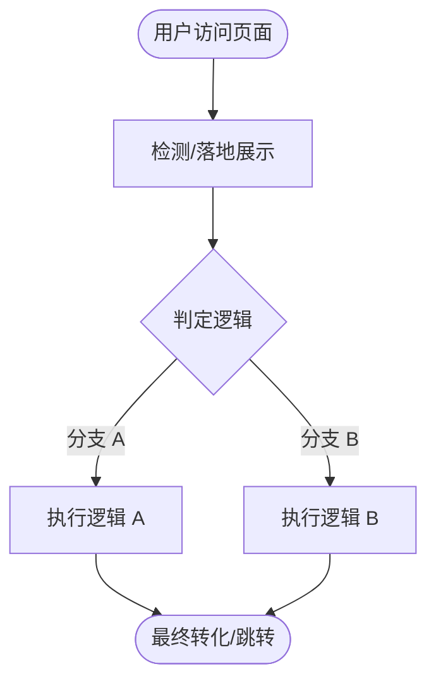

# 000 · 100 HTML 单页逆向工程标准规范与分析模板 (Reference Specification)

> **版本**：v1.0.0  
> **适用场景**：100 个高价值/黑产防封/AI生成/裂变营销/Web3D/知识付费等单页 HTML 的标准化逆向分析与代码解构  
> **核心目标**：统一全套 100 个逆向项目的命名规范、目录结构、分析报告框架（README.md）与交付质量标准。

---

## 1. 项目命名与目录组织规范

### 1.1 目录命名格式
所有逆向项目文件夹均采用 **3 位递增序号 + 项目中文核心功能与商业定位** 的规范命名：
```
000 项目规范与逆向分析标准/       <-- 规范、脚手架与 Reference 模板
001 伪装安全检测防封跳板页/       <-- 序号 001
002 MBTI天赋激活测评-AI知识付费单页工具/ <-- 序号 002
003 许愿柳-ThreeJS玄学互动祈愿单页/  <-- 序号 003
...
100 终极综合逆向全景案例/         <-- 序号 100
```

### 1.2 单元项目内部标准结构
每个独立的逆向工程文件夹内需严格包含以下核心要素：
```
00X 项目名称/
├── index.html          # [必须] 主入口单页（原 html 统一规整为 index.html）
├── README.md           # [必须] 严格按照下文标准模板编写的逆向深度分析报告
├── main.js / app.js    # [可选] 若原站拆分了 JS
├── style.css           # [可选] 若原站拆分了 CSS
└── assets/             # [可选] 依赖的本地图片、音频、字体或 3D 资源
```

---

## 2. 标准逆向分析报告模板 (README.md Template)

每个逆向项目的 `README.md` 必须涵盖以下 **6 大核心分析维度**，可直接复制以下模板：

```markdown
# [项目序号] [项目中文名称] - 逆向深度解析报告

> **项目归档名称**：`00X 项目名称`  
> **核心入口文件**：`index.html` (约 XX KB / XX 行)  
> **技术形态**：[例如：纯前端 All-in-One SPA / WebGL Three.js / Canvas 2D / 状态机单页]  
> **商业/业务属性**：[例如：流量防封跳板 / 小红书知识付费引流 / 玄学互动裂变]  

---

## 1. 项目概览与全景画像

| 维度 | 详细解析 |
| :--- | :--- |
| **所属行业/赛道** | [例如：黑灰产流量对抗 / 知识付费 / 情感玄学] |
| **核心文件规模** | [例如：index.html (22 KB), 样式 1400 行, 脚本 1100 行] |
| **技术架构栈** | [例如：Vanilla HTML5 + CSS3 + ES6 JS + Three.js] |
| **第三方依赖与组件**| [例如：百度统计、Google Fonts、Three.js CDN 等] |
| **核心业务诉求** | [一句话阐述该页面最终想达到的商业或技术目标] |

---

## 2. 核心业务流程与状态机 (Mermaid Flowchart)

[使用 Mermaid 绘制完整的用户交互流、状态流转或流量分流图]



---

## 3. 技术机制与代码逻辑深度拆解

### 3.1 [关键机制一：如 设备指纹检测 / 状态机切换 / 3D 场景初始化]
- 技术原理说明；
- 关键代码片段摘录与逻辑标注；

### 3.2 [关键机制二：如 算法模型 / 题目加权 / 伪随机扰动 / 物理渲染]
- 算法细节剖析；
- 核心代码段；

### 3.3 [关键机制三：如 防逆向 / 源码保护 / 假加载动效]
- 防审查手段或用户心理学延时机制；

---

## 4. 架构特征与生成形态剖析

- **是否为典型 AI 生成代码**：[是 / 否]
- **特征证据链**：
  1. 结构特征（如规整的大段 JSON 字典、高度对称的 Schema）；
  2. 文案与黑话特征（如“认知颗粒度”、“复利飞轮”等）；
  3. 算法小技巧（如确定性加权 + 取模伪随机）；
  4. 零工程化 All-in-One 纯内联单文件特征。

---

## 5. 商业化套路与心理学机制拆解

- **流量漏斗与转化路径**：[曝光 ➔ 唤醒 ➔ 沉没成本 ➔ 信任建立 ➔ 付费转化]；
- **心理学效应应用**：[如巴纳姆效应、损失厌恶、沉浸仪式感等]；
- **风控与对抗策略**：[如何规避平台封禁、如何阻断 PC 端审核人员等]。

---

## 6. 代码质量评估与重构优化建议

- **亮点与可借鉴之处**；
- **潜在缺陷与漏洞**（如 XSS 风险、内存泄漏、前端易破解等）；
- **生产级升级路线**。
```

---

## 3. 逆向工程评估矩阵与分类标准

在分析 100 个 HTML 项目时，可归类于以下 **8 大核心阵营**：

| 类别代号 | 类别名称 | 典型特征与代表场景 |
| :---: | :---: | :---: |
| **SEC** | **安全防御 / 防封跳板** | User-Agent 过滤、PC 端拦截重定向、爬虫屏蔽、动态 Cloaking |
| **AI-EDU** | **AI 生成 / 知识付费** | MBTI/星座/九型测评、高客单引流、千字定制报告、全量 JSON 字典 |
| **WEB3D** | **3D 沉浸 / 玄学互动** | Three.js / WebGL / Canvas、祈愿许愿、抽签占卜、动效粒子 |
| **MKT** | **爆款营销 / 裂变拉新** | 倒计时秒杀、拼团砍价、朋友圈海报生成、虚假滚屏弹幕 |
| **TOOL** | **实用工具 / 效率单页** | 格式转换、色彩提取、计算器、零后端本地存储小工具 |
| **GAME** | **轻量小游戏 / 互动单页** | 消除、跑酷、合成大西瓜类、Canvas 物理小游戏 |
| **FORM** | **高转化留资 / 表单获客** | 医美/驾考/装修/留学低门槛引流测算表单、电话线索捕获 |
| **HACK** | **极客逆向 / 混淆加密** | JSFuck、AAEncode、JScrambler、控制流平坦化还原 |
