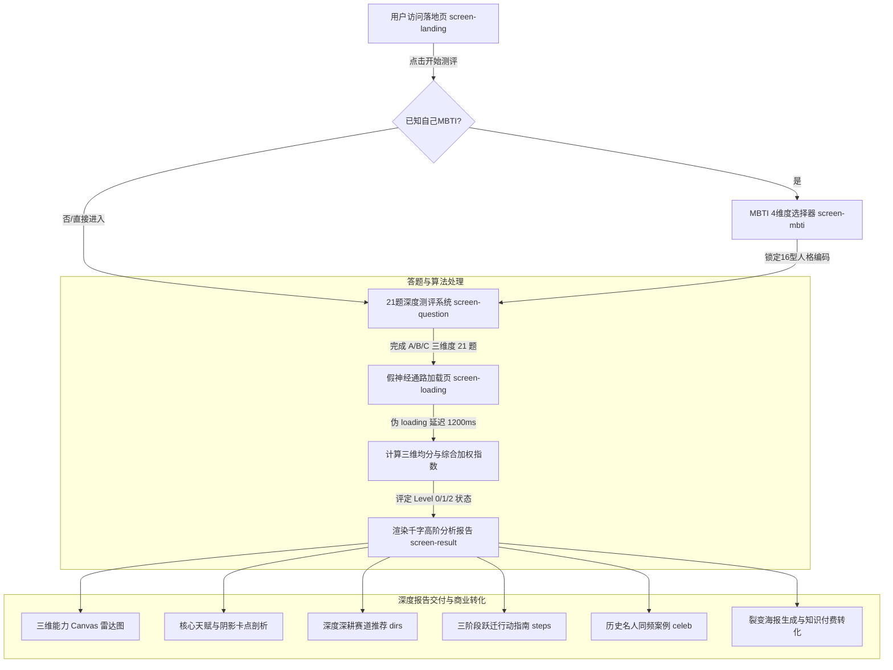

# MBTI 天赋激活测评 - AI 逆向深度解析报告

> **项目归档名称**：`002 MBTI天赋激活测评-AI知识付费单页工具`  
> **核心入口文件**：`index.html` (约 141 KB / 2922 行)  
> **技术形态**：纯前端 All-in-One 单文件 SPA (Vanilla HTML5 + CSS3 + ES6 JavaScript + Canvas 2D)  
> **商业属性**：小红书 / 微信生态高客单知识付费、咨询引流、IP 人设孵化的典型测评营销转化单页  

---

## 1. 项目概览与全景画像

| 维度 | 详细解析 |
| :--- | :--- |
| **所属行业** | 个人成长 / 认知教练 / 心理测评 / MBTI 高阶商业转化 |
| **技术架构** | 零依赖纯前端单页架构（无任何 NPM 包、无 Webpack/Vite 构建、零框架） |
| **UI/视觉系统** | 莫兰迪玫瑰粉调（`--pink: #d4708a`）+ 墨紫（`--ink: #1e1820`）+ 思源宋体（`Noto Serif SC`）人文杂志质感 |
| **核心交互流** | 落地痛点展示 $\rightarrow$ 16型 MBTI 快速定位 $\rightarrow$ 21 道三阶激活测评题 $\rightarrow$ 伪 AI 神经通路计算过渡 $\rightarrow$ 千字深度报告与转化 |
| **数据规模** | 内置 16 种完整 MBTI 高阶人格字典（500+ 行规整 JSON）、21 道维度测试题、3 阶跃迁评级模型 |
| **代码生成特征** | **100% 典型的 AI（Prompt 投喂）一次性生成的单文件 SPA**，具备严密对称的 Schema、伪随机扰动算法与原生 Canvas 手绘图表 |

---

## 2. 核心业务与状态机流转 (State Machine)

整个单页应用完全由单一状态函数 `showScreen(id)` 驱动，通过控制 DOM 节点的 `.active` 类名实现页面间的无缝平滑切换：



---

## 3. 代码架构与技术实现拆解

### 3.1 极简状态机与 DOM 渲染
整个系统没有使用 Vue 或 React，而是采用极其直接的原生 DOM 状态机：

```javascript
function showScreen(id) {
  document.querySelectorAll('.screen').forEach(s => s.classList.remove('active'));
  const target = document.getElementById(id);
  if (target) target.classList.add('active');
  window.scrollTo(0, 0);
}
```

### 3.2 21 题三维测试题库设计
题目分为三大维度，每维度各 7 道题，每个选项对应固定的分值权重：

| 维度代码 | 维度名称 | 考察核心 | 题目数量 | 选项分值区间 (低/中/高) |
| :---: | :---: | :---: | :---: | :---: |
| **A** | **天赋调用度** | 核心能力是否被真正调用还是停留在空转思考 | 7 题 | 15~25 / 50~60 / 85~92 |
| **B** | **输出稳定性** | 是否具备持续交付的成果与稳定的节奏 | 7 题 | 15~22 / 50~58 / 82~92 |
| **C** | **方向清晰度** | 知不知道天赋应用于何种细分赛道与高杠杆战场 | 7 题 | 18~25 / 50~55 / 80~92 |

### 3.3 计分算法与伪随机扰动机制
系统在计算分数时采用了加权模型，并巧妙地注入了**伪随机扰动因子**，使结果看起来像“深度 AI 动态分析”：

```javascript
// 1. 维度均分与综合加权计算
function calcScores() {
  const totals = [0, 0, 0];
  const counts = [0, 0, 0];
  const dimMap = { A: 0, B: 1, C: 2 };

  qAnswers.forEach((ans, qi) => {
    if (ans === undefined || ans === null) return;
    const q = questions[qi];
    const d = dimMap[q.dim];
    totals[d] += q.scores[ans][d];
    counts[d]++;
  });

  const scores = totals.map((t, i) => counts[i] > 0 ? Math.round(t / counts[i]) : 50);
  // 加权综合分：天赋调用度(35%) + 输出稳定性(35%) + 方向清晰度(30%)
  const overall = Math.round((scores[0] * 0.35 + scores[1] * 0.35 + scores[2] * 0.30));
  return { scores, overall };
}

// 2. 伪随机微调算法（AI生成代码的经典小技巧）
const scoreVariation = (qAnswers.reduce((a,b) => a + (b||0), 0) % 8) - 4;
const displayScore = Math.min(98, Math.max(12, overall + scoreVariation));

const varSeeds = qAnswers.slice(0,3).map((a,i) => ((a||0) * (i+3)) % 7 - 3);
const variedScores = scores.map((s,i) => Math.min(95, Math.max(8, s + varSeeds[i])));
```

### 3.4 纯原生 HTML5 Canvas 动态雷达图
为了不引入体积庞大的 ECharts 或 Chart.js，页面直接利用 80 余行原生 Canvas 2D 代码手绘三维雷达图：
- 计算正三角形的顶点坐标：`angles = labels.map((_, i) => (Math.PI * 2 * i / 3) - Math.PI / 2);`
- 绘制 4 层半透明同心多边形网格背景；
- 填充径向渐变（`createRadialGradient`）的能力多边形；
- 自动适配高分屏 `devicePixelRatio`，确保在手机端 Retina 屏上文字清晰不发糊。

---

## 4. 为什么判定为“典型 AI 生成的代码”？

通过对代码结构、变量命名、文本风格和架构形态的逆向分析，可以 100% 确认该站点是由 AI（如 Claude 3.5 Sonnet 或 GPT-4o）通过精准 Prompt 一次性生成的单页应用：

### 特征 1：高度对称且完备的 16 型 MBTI JSON 字典
在 `personas` 常量中，定义了从 `INTJ` 到 `ESFP` 全部 16 种人格，每一个人格都严格包含以下 13 个字段，且结构完全一致，没有缺失任何一个属性：
```json
{
  "name": "副标题人设",
  "hit": "一句话直击痛点",
  "gifts": [ {"icon": "...", "name": "...", "desc": "..."} * 3 ],
  "wastedGift": { "title": "...", "desc": "..." },
  "deep": [ "深度洞察1", "深度洞察2", "深度洞察3" ],
  "guide": "核心破局原则",
  "pattern": "决策陷阱模式剖析",
  "dirs": [ {"icon": "...", "name": "...", "desc": "..."} * 4 ],
  "blockers": [ {"icon": "...", "name": "...", "desc": "..."} * 3 ],
  "steps": [ {"title": "...", "desc": "..."} * 3 ],
  "signals": [ "觉醒信号1", "觉醒信号2", "觉醒信号3" ],
  "tags": [ "标签1", "标签2", "标签3", "..." ],
  "combo": { "tag": "...", "desc": "..." }
}
```
> **AI 痕迹分析**：人类手写如此规整且庞大的 16 人格全量字典极易出现字段缺失或格式偏差，而大语言模型（LLM）在给定 JSON Schema 后能极其工整地一次性输出上万字的结构化数据。

### 特征 2：极其浓厚的“AI 知识付费黑话”文风
文案中高频使用当代教练技术、个人商业化与 AI 心理学特有的排比与术语：
- **概念重构**：“低阶无序消耗态” $\rightarrow$ “觉醒期探索态” $\rightarrow$ “高阶复利闭环态”；
- **AI 常用词汇**：“战略颗粒度”、“最小行动版本”、“复利飞轮”、“高维闭环”、“能量内耗”、“杠杆点”、“认知对齐”；
- **句式结构**：“你不是不知道……你是不确定这个能力值不值得被相信”、“你正在浪费的不是时间，是判断力”。

### 特征 3：零工程化的 All-in-One 单文件代码风格
- 所有的 HTML 骨架、1400+ 行内联 CSS、1100+ 行原生 JS 和 50KB 数据字典全部压缩在一个单个 `.html` 文件中。
- 没有模块化导入（`import/export`），没有 NPM 依赖，所有逻辑使用平铺的全局变量与函数，完全符合用户向 AI 提问：“*帮我写一个完整的、单文件即可直接运行的 MBTI 测评网页，包含精美 UI、题库与测试报告*”的标准输出。

### 特征 4：仪式感驱动的“假加载动效”
- 在点击最后一题后，界面切换到 `#screen-loading`，并通过 `setTimeout` 硬编码等待 1200ms；
- 界面上显示“正在解析神经通路与认知模式”、“正在构建三阶激活全景图”；
- 这种通过纯前端假 loading 来制造“后端有庞大算法/AI 正在为您深度定制报告”的心理暗示，是 AI 提示词落地页生成中非常经典的 Prompt 套路。

---

## 5. 商业化与心理学转化机制剖析

该站点不仅是一个测评工具，更是一套极其成熟的**高客单知识付费转化漏斗**：

```
[痛点唤醒] 落地页揭示低阶消耗态 ➔ 制造对现状的焦虑与不满
     ↓
[沉没成本] 投入 3-5 分钟完成 21 道测评题 ➔ 建立测试严肃感与仪式感
     ↓
[巴纳姆效应] 用“高标准/完美主义阻碍了你”等赞美式批评 ➔ 建立极高信任感
     ↓
[阶梯跃迁] 给出清晰的 Level 0 ➔ Level 2 路径 ➔ 唤醒“我也能成为高阶”的渴望
     ↓
[商业转化] 引导添加主理人/购买天赋激活咨询/进入知识星球社群
```

1. **巴纳姆效应（Barnum Effect）的降维打击**：
   - 所有的“卡点/缺点”描述都被巧妙地包装成了“高阶天赋的副作用”。
   - 例如对 INTJ 的评价：“*你的判断力一直在帮自己不行动——你能看出大多数路径的问题，但这个能力被反向使用了*”。这种表达让受测者感到被深深理解，瞬间建立起无条件的信任。
2. **三阶激活模型（制造向上认同）**：
   - 测试结果将用户划分为【0阶 沉睡期】、【1阶 觉醒期】、【2阶 高维闭环】；
   - 90% 以上的用户会被计算在 0阶 或 1阶，系统随即提供“破局第一步”与“名人案例（乔布斯蛰伏12年、村上春树酒吧创业）”，顺理成章地承接高阶社群或咨询服务的付费转化。

---

## 6. 总结与改进建议

### 6.1 核心价值
- **极高的交付效率**：借助 AI 实现了通常需要前端工程师、UI 设计师、文案策划和心理学顾问协作数周才能完成的产品级单页。
- **优秀的美学审美**：采用高定莫兰迪色系、思源宋体搭配轻量微阴影，摆脱了传统粗糙测评页的廉价感。

### 6.2 可优化迭代方向
1. **数据持久化与分享裂变**：当前报告刷新即丢失，可引入 `html2canvas` 导出高清海报图，或利用 `localStorage` 缓存测试结果；
2. **后端支付/线索闭环**：在结果页末尾直接集成微信支付 JSAPI、短信验证码留资或企微二维码弹窗，实现完整的商业变现闭环；
3. **更精准的动态权重**：可将 21 题与 16 种具体 MBTI 类型的八维认知功能（Ni/Ne, Ti/Te, Fi/Fe, Si/Se）做更深度的动态加权联动。
