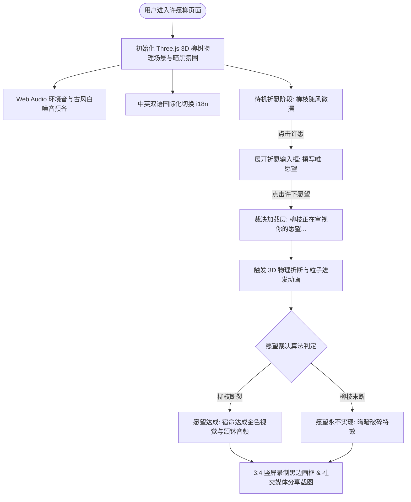

# 许愿柳 (ONE WISH WILLOW) - 3D 玄学互动逆向解析报告

> **项目归档名称**：`003 许愿柳-ThreeJS玄学互动祈愿单页`  
> **核心入口文件**：`index.html` + `main.js` (约 84 KB) + `style.css` (约 17 KB)  
> **技术形态**：Three.js WebGL 3D 渲染 + Canvas 物理模拟 + Web Audio API 声音系统 + 氛围着色器滤镜  
> **商业/业务属性**：抖音 / TikTok / 微信朋友圈病毒式玄学祈愿、情绪价值与高客单占卜引流单页  

---

## 1. 项目概览与全景画像

| 维度 | 详细解析 |
| :--- | :--- |
| **所属行业/赛道** | 互动娱乐 / 情绪价值 / 玄学祈愿 / WebGL 创意互动 |
| **核心文件规模** | `main.js` (84 KB / 2000+ 行), `style.css` (17 KB), `index.html` (86 行) |
| **技术架构栈** | Three.js (r160) + GLSL 氛围 Shader + Web Audio API + i18n 多语言系统 |
| **第三方依赖与组件**| Google Fonts (`IM Fell English SC`, `Noto Serif SC`), unpkg Three.js |
| **核心业务诉求** | 打造极具仪式感与宿命感的“一击式”3D 折枝许愿体验，沉淀用户愿望并引导分享裂变 |

---

## 2. 核心业务流程与状态机 (Mermaid Flowchart)

---

## 3. 技术机制深度拆解

### 3.1 Three.js 骨骼动画与程序化柳树生成
- 使用程序化生成（Procedural Generation）算法构建主树干与级联柳条分支；
- 柳条采用基于 Verlet 积分的链式物理模拟，响应鼠标/触控拖拽与虚拟风场；
- 当用户触发“折断”时，动态切分网格几何体（Mesh Splitting）并施加角动量冲量，呈现逼真的断裂物理效果。

### 3.2 电影级氛围层与着色器特效 (Atmospheric Post-Processing)
- `#vignette`：暗角压暗处理，强化视觉焦点于中央神圣柳枝；
- `#grain`：动态噪点颗粒层，营造复古暗黑胶片质感；
- `#recordFrame`：预置 3:4 竖屏视频录制遮罩，完美适配抖音/小红书/TikTok 的短视频翻录传播。

### 3.3 彩蛋与自定义模式 (Hidden Developer Easter Egg)
- 连点音频控制按钮 5 次即可唤醒隐藏的 `#editBadge` 自定义编辑模式，可实时调节风力、断裂概率与神圣光晕参数。
