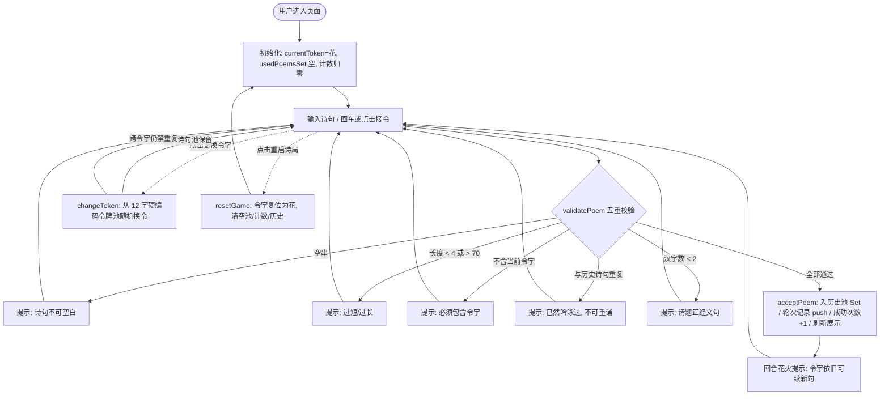

# 004 硬编码的飞花令 - 逆向深度解析报告

> **项目归档名称**：`004 硬编码的飞花令`  
> **核心入口文件**：`index.html` (约 23.6 KB / 601 行，单文件 All-in-One)  
> **技术形态**：纯前端 Vanilla HTML5 + CSS3 + ES6 JS 内联单页状态机小游戏，零第三方依赖  
> **商业/业务属性**：诗词文化互动益智页 / 语文教学与课堂同乐工具 / 文化类自媒体引流落地页  

---

## 🪦 鉴shit 评分卡 (Gallery Verdict)

| 维度 | 评分 | 一句话槽点 |
| :--- | :---: | :--- |
| 可玩性 | ★★★☆☆ | 没 AI 对手、没题库，飞花令全靠玩家自己脑补，实际是"自由创作合规器" |
| 代码质量 | ★★★☆☆ | 校验管线清晰、状态模型自洽，但三处复制粘贴样板 + 一个真实 XSS |
| 安全性 | ★★☆☆☆ | `innerHTML` 直接拼用户输入，`花` 一发入魂 |
| 工程化 | ★☆☆☆☆ | 零持久化，刷新即失忆；`timestamp` 字段写入后从未被读过，纯摆设 |
| 反逆向 | ★☆☆☆☆ | 快捷键拦截 = 皇帝的新衣，先开 DevTools 再进页面一秒破功 |
| 文案腔调 | ★★★★☆ | "风雅卓绝""才名 +1"——AI 拟古文拿捏到位，是全页最能装的部分 |

**总评：SHIT 指数 6.5 / 10 —— 中上水平的 shit。**
> 一款"自称无预设例句、实则把全部规则硬编码死"的诗词合规判定器：
> 骨架是好的（校验管线五重、状态机自洽），
> 但顶着"自主接令"的名头啥也不判，插着"源码保护"的旗子啥也不防，
> 唯一拿得出手的是一张古风皮和一句"君判输赢"的甩锅哲学。

---

## 1. 项目概览与全景画像

| 维度 | 详细解析 |
| :--- | :--- |
| **所属行业/赛道** | 文化教育 / 诗词互动 / 轻量小游戏（GAME 阵营） |
| **核心文件规模** | `index.html` (23,652 字节 / 601 行)：CSS 约 325 行，HTML 结构约 43 行，JS 逻辑约 207 行 |
| **技术架构栈** | Vanilla HTML5 + CSS3（渐变/阴影/伪元素古风视觉）+ ES6（let/箭头函数/Set/模板字符串），无框架无构建 |
| **第三方依赖与组件**| 无 CDN、无字体库、无统计代码；仅有一处 `data-html2web-source-protection` 内联反审查脚本（html2web 打包工具注入指纹，高度疑似） |
| **核心业务诉求** | 打造一款"无预设例句、玩家自主接令、系统仅做文字合规判定"的飞花令对诗工具：记录成功次数与轮次，支持换令字与重置，用于课堂互动、诗词社群切磋与才情展示引流 |

---

## 2. 核心业务流程与状态机 (Mermaid Flowchart)



**状态说明**：整个游戏是典型的"单状态 + 无 AI 对手"结构——不存在回合制敌我状态机，只有 **接令校验 → 成功入库 → 继续接令** 的线性循环，外加"换令字"（保留历史池）与"重置"（清空一切）两个操作分支。

---

## 3. 技术机制与代码逻辑深度拆解

### 3.1 核心校验器 `validatePoem()` —— 五重合规判定

游戏宣称"只判断合法性及重复"，其判定管线（`index.html` L458-485）依次执行：

1. **非空**：`trim()` 后为空串直接拒绝；
2. **长度区间**：`4 <= length <= 70`，防止不成句的碎片与超长粘贴；
3. **令字包含**：`trimmed.includes(token)`，令字可为多字节字符（如"花"）；
4. **全局去重**：`usedPoemsSet.has(trimmed)`，全等比对（trim 后），**无视作者只比对文本**；
5. **汉字下限**：正则 `/[\u4e00-\u9fa5]/g` 统计汉字数，少于 2 拒绝，过滤纯标点/纯数字/表情串。

```javascript
// 关键摘录（L470-482）
if (!trimmed.includes(token)) {
    return { valid: false, reason: `诗句中必须包含令字 “${token}”，请重新斟酌。` };
}
if (usedPoemsSet.has(trimmed)) {
    return { valid: false, reason: `此句 “${...}” 已然在飞花令中吟咏过，不可重诵。` };
}
const chineseCount = (trimmed.match(/[\u4e00-\u9fa5]/g) || []).length;
if (chineseCount < 2) {
    return { valid: false, reason: "请题写正经诗词文句，至少包含两个汉字。" };
}
```

> **逆向要点**：校验只做"形式合规"，完全不做诗词真实性与意境判断——这与页眉口号"君判输赢"完全自洽：系统把审美裁决权交给玩家，自己只当"纪律委员"。

### 3.2 内存态状态机与回合账本

所有游戏状态均为页面级内存变量（L404-408），**无 localStorage/无后端**：

| 状态变量 | 类型 | 职责 |
| :--- | :--- | :--- |
| `currentToken` | String | 当前令字，初始硬编码为 `"花"` |
| `usedPoemsSet` | Set | 全量已用诗句池（跨令字共享） |
| `successCounter` | Number | 累计成功次数 |
| `roundHistory` | Array | 每轮记录 `{poemText, tokenWhenSubmit, timestamp}` |
| `lastPoem` | String/null | 最近一次成功接令文本 |

- 成功路径 `acceptPoem()`：入池 → 记账 → 计数 +1 → `updateStatsUI()` 刷新分数栏 → 输入框清空并聚焦；
- 消息系统 `setMessage()`：2200ms 自动渐隐恢复默认文案，错误态用红色/浅红配色区分。

### 3.3 换令字与重启 —— 硬编码令牌池与"跨令字禁重复"

```javascript
// L525 —— 令字池硬编码写死，共 12 字
const tokenOptions = ["花", "月", "春", "秋", "山", "水", "风", "雪", "酒", "剑", "竹", "梅"];
```

- `changeToken()`：`while` 循环随机换一个与当前不同的令字（池长 12，理论安全；若池长 ≤ 1 将死循环，属防御性缺陷）；
- **关键设计**：换令后 `usedPoemsSet` **不清空**，即跨令字也禁止重复任何已出现诗句——注释明言"增加挑战性"；
- `resetGame()`：全量复位——令字回 `"花"`、清池、清零计数与轮次、清空展示，相当于重开一局。

### 3.4 反逆向与源码保护层

页面顶部（L4-18）注入了一段 `data-html2web-source-protection` 标记的脚本：

- **快捷键拦截**：`F12`、`Ctrl+Shift+I/J/C`（DevTools 三件套）、`Ctrl+U`（源码）、`Ctrl+S`（另存为）；
- **右键封锁**：捕获阶段 `contextmenu` 全局 `preventDefault`；
- **特征指纹**：`data-html2web-source-protection` 属性是 html2web 类"HTML 打包为网页 + 一键源码保护"工具的注入标识，据此可高度推断该页面最终经此类工具封装过壳。

**防御强度评估（弱）**：无 DevTools 开启检测循环、无 `debugger` 反调试、无 iframe 嵌套检测、无 UA 分流。先开 DevTools 再进页面、或直接禁用 JS，防护即全部失效——与 001 的完整防封体系相比属于"面子工程"级别。

### 3.5 古风视觉系统

- **全局底纹**：`body::before` 内联 SVG data-URI 梅花暗纹（68px 平铺，opacity 0.12），零网络请求；
- **卷轴卡片**：非对称圆角 `56px 32px 64px 36px` + 多层渐变 + 阴影，模拟宣纸卷轴；
- **字体栈**：`华文楷书 → STKaiti → 楷体 → Georgia → serif`，纯本地字体栈零加载；
- **移动端适配**：`@media (max-width: 580px)` 收缩令字字号、输入区纵向排列、分数栏折叠。

---

## 4. 架构特征与生成形态剖析

- **是否为典型 AI 生成代码**：**高度疑似（置信度高）**
- **特征证据链**：
  1. **指令式注释回声**：代码注释几乎逐条复述设计需求（L397-401 把"无预设例句/不重复/可换令牌/重启诗局"每条规则再写一遍），L594-596 在结尾又整段总结"完全满足：不提供例句，玩家自主接令…"——典型 LLM 生成时"需求-实现-复述"的冗余痕迹；
  2. **重复的模式样板**：`turnHintSpan` 的"改文案 → setTimeout 还原"模式在换令、接令、重置三处各写一遍，且超时值 1500/1800/1500 各不相同，呈现手写拼接而非抽象复用；
  3. **零工程化 All-in-One**：23.6 KB 单文件、无构建、无外部依赖、无测试、无持久化，是"一次性生成即交付"的形态；
  4. **文案腔调**：界面文案（"风雅卓绝""才名""雅士风流"）与注释口吻（"为了更友好""完全不干涉玩家创作"）带有明显的 AI 拟古文风。

---

## 5. 商业化套路与心理学机制拆解

- **流量漏斗与转化路径**：本页没有典型的变现漏斗，转化点在于**内容价值与互动留存**——曝光（古风视觉吸引）→ 进入（零门槛自由输入）→ 沉浸（仪式感卷轴 + 回合积累）→ 沉淀（成功次数/轮次记录形成个人成绩）→ 传播（可截图分享诗词才情，具备社群裂变潜质）。此类页面常见于诗词教育机构、语文博主、文化类自媒体的互动引流与私域暖场。
- **心理学效应应用**：
  - **仪式感与沉浸感**：卷轴、令牌、书眉等古风元素制造"雅集"氛围，降低工具感；
  - **自我挑战与成就动机**：成功次数计分 + 轮次记录，驱动玩家"再破一轮"；
  - **沉没成本与难度递增**：历史诗句池永久累积且跨令字禁重复，接得越多可选句越少，玩家已投入的轮次成为继续下去的心理锚点；
  - **自主掌控感**："君判输赢"把审美裁决权交还玩家，规避了机器判罚的争议，也绕开了诗词判定的技术难点。
- **风控与对抗策略**：仅一层 html2web 源码保护（快捷键/右键封锁），**无** UA 分流、无爬虫屏蔽、无跳转引导——属于低对抗强度的文化工具页，与 001 的防封跳板页定位完全不同。

---

## 6. 代码质量评估与重构优化建议

### 亮点与可借鉴之处
1. **状态模型简洁自洽**：5 个状态变量覆盖全部游戏语义，校验管线顺序合理、错误文案友好；
2. **部分输出已注意安全**：历史诗句展示走 `innerText`（L429-430）而非 innerHTML，说明作者有基础安全意识；
3. **零依赖高性能**：无任何外部资源，离线可用，加载即秒开；
4. **视觉完成度高**：SVG data-URI 底纹 + 本地字体栈，兼顾美观与零请求。

### 潜在缺陷与漏洞
1. **存储型 XSS（真实风险）**：`setMessage()` 使用 `messageBox.innerHTML` 拼接用户输入（L441），而校验器**不剥离 HTML 标签**。输入 `花` 满足"≥4 字符 + 含令字 + ≥2 汉字 + 不重复"全部条件，成功接令后 `acceptPoem()` 将其拼入 `setMessage` 的 innerHTML 即触发执行；重复句的拒绝提示（L476）同样拼接用户文本。虽属"自己打自己"的自 XSS，但若用于课堂投屏/社群共享场景则存在跨用户投毒面；
2. **无持久化**：刷新即清空全部成绩与历史，`roundHistory` 的 `timestamp` 字段从未被读取（死数据）；
3. **防御性缺陷**：`changeToken` 的 `while` 循环在令牌池缩至 1 时死循环；输入框无 `maxlength` 属性（虽校验层限 70 字符）；
4. **体验细节**：三处 `setTimeout` 还原提示存在竞态——快速连续操作时先触发的 timeout 可能覆盖后设置的新文案（L503/541/558 的还原回调未互相清理）；
5. **伪校验空间**：只要凑够 2 个汉字即可过审（如"花与花"），配合跨令字禁重复，后期玩家会被迫凑字而非对诗。

### 生产级升级路线
1. **修复 XSS**：`setMessage` 改用 `textContent`，或对诗句文本做 HTML 实体转义白名单；
2. **持久化**：`usedPoemsSet / successCounter / roundHistory` 同步写入 localStorage，进页自动恢复，`roundHistory` 增加"清空记录"入口；
3. **功能增强**：新增"已接诗句历史面板"（可折叠）供课堂回顾；支持令字自定义输入（突破 12 字硬编码池）；`changeToken` 改数组过滤写法杜绝死循环；
4. **真实性升级（可选）**：内置诗词语料库做"是否真实存在"的提示性判定（不强制），或接入大模型 API 做 AI 对诗对手，升级为真正的人机飞花令；
5. **工程化**：将 `validatePoem` 等纯函数抽离为可单测模块，UI 层加防抖；如需防倒卖/防篡改再考虑混淆层，但当前"反审查脚本 + 明文逻辑"的组合在攻防上意义有限。
