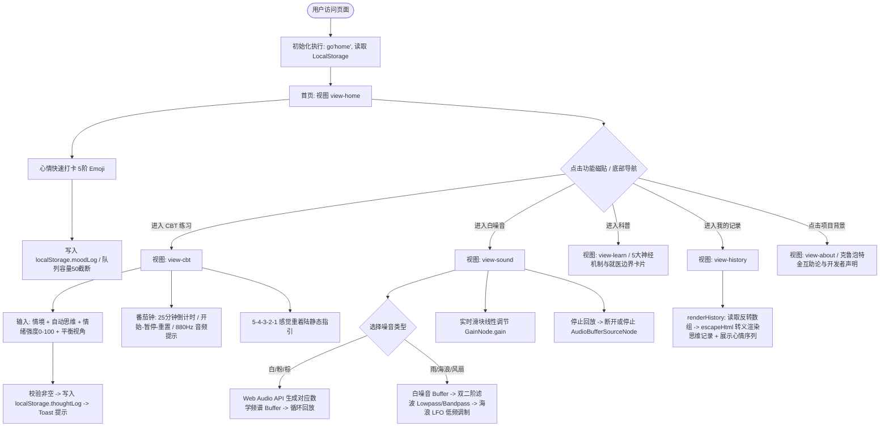

# 006 粉云星球-ADHD互助小站与免费CBT - 逆向深度解析报告

> **项目归档名称**：`006 粉云星球-ADHD互助小站与免费CBT`  
> **核心入口文件**：`index.html` (约 29.5 KB / 661 行，单文件 All-in-One SPA) + `assets/icon.png` (563 KB)  
> **技术形态**：纯前端 Vanilla HTML5 + CSS3 + ES6 JS + Web Audio API 纯客户端过程化噪声声学合成 + LocalStorage 本地持久化  
> **商业/业务属性**：公益互助 / 神经多样性 (ADHD) 认知行为干预 (CBT) 自助工具 / 知乎科学季生成式落地单页  

---

## 品鉴评分卡 (Gallery Verdict)

| 维度 | 评分 | 核心分析与定性 |
| :--- | :---: | :--- |
| **实用价值与善意度** | 9.0 / 10 | 选题立意极佳，切中成人及青少年 ADHD 认知负荷过载、情绪失控与执行功能障碍的真实痛点，无广告变现诱导，纯本地存储尊重隐私。 |
| **算法与音频工程** | 8.5 / 10 | 纯代码实现 Web Audio API 过程化噪声合成器（白/粉/棕三色噪声数学建模 + LFO低频振荡海浪调制 + 双二阶滤波模拟风扇与降雨），实现零外部音频资源的实时无限合成。 |
| **代码规范与健壮性** | 5.5 / 10 | 存在典型的单页脚本瑕疵：路由 monkey-patch 伪监听未接入真实 hashchange、番茄钟每次提示均重复构造 AudioContext 存在耗尽配额风险、白噪音循环 Buffer 存在首尾跳变杂音。 |
| **安全与防御面** | 6.0 / 10 | 思维记录模块具备明确的 HTML 转义意识，但心情记录模块存在二次拼接 innerHTML 的潜在注入面；无任何混淆与反逆向，完全明文交付。 |
| **生成形态与工程化** | 5.0 / 10 | 单文件内联 600 余行代码，遗留典型大模型提示词插入标记 `<!-- VIEWS_INSERT_POINT -->`；缺少自动化测试与模块解耦。 |
| **伦理与托管反差** | 4.0 / 10 | 文本声明高呼“不追踪、不上传、纯属互助”，但因托管于知乎 AI Works 平台（aiworks.site），被宿主平台在 head 首行强行注入了跨域数据埋点与追踪网桥，构成平台资本主义与草根互助理念的技术讽刺。 |

**总评：综合指数 7.2 / 10 —— 一款立意高尚、算法灵巧却带有典型平台束缚与 AI 生成痕迹的治愈系草根单页。**  
> 这不是一款充满商业套路与心理收割的黑产营销页，而是一份由“ADHD 左派女程序员”借由大语言模型与知乎 AI 平台快速拼装的循证心理学数字急救包。它的技术高光在于极为轻盈精妙的 Web Audio 过程化声学合成，而它的戏剧性张力则在于其“反商业互助宣言”与“知乎平台强制埋点代码”共居一室的现实悖论。

---

## 1. 项目概览与全景画像

| 维度 | 详细解析 |
| :--- | :--- |
| **所属行业/赛道** | 心理健康 / 神经多样性 (ADHD) / 认知行为疗法 (CBT) / 公益互助工具单页 |
| **核心文件规模** | `index.html` (29,541 字节 / 661 行)：样式表约 140 行，HTML 结构约 260 行，原生 JS 逻辑约 230 行；本地静态资源 `assets/icon.png` (563 KB) |
| **技术架构栈** | 零依赖纯前端架构：Vanilla HTML5 + 原生 CSS 自定义属性（设计令牌 Design Tokens）+ 原生 ES6 + Web Audio API + LocalStorage 队列 |
| **第三方依赖与组件**| 运行逻辑无任何外部 NPM/CDN 库；仅包含宿主平台知乎自动注入的 `tracking.aiworks.site` 全埋点桥接脚本与针对 `zhihu.com` 域名的 postMessage 接收器 |
| **核心业务诉求** | 为 ADHD 患者及注意力障碍人群提供低门槛、无干扰的日常情绪与注意力辅助工具：涵盖五阶心情打卡、认知行为三栏式思维记录、25 分钟番茄钟、5-4-3-2-1 接地技术指引、六种过程化白噪音及脑科学科普 |

---

## 2. 核心业务流程与状态机 (Mermaid Flowchart)

本页面为单容器伪路由架构，通过 JavaScript 动态切换激活视图（`.view.active`）与底部导航状态：



---

## 3. 技术机制与代码逻辑深度拆解

### 3.1 Web Audio API 纯客户端过程化声学合成机制

本单页最亮眼的技术实现是完全摒弃了传统网页挂载 MP3/WAV 音频外链的做法，使用 Web Audio API 原生算子，在客户端浏览器实时计算并合成了 6 种声学环境：

#### 1. 白噪音、粉红噪音与棕色噪音（三种基础色彩噪声数学模型）
在 `makeNoiseBuffer(type)` 函数中，系统预先开辟一段 2 秒（`audioCtx.sampleRate * 2` 个采样点）的单声道 `AudioBuffer`，并通过算法填充采样数据：

- **白噪音 (White Noise)**：
  每个采样点取值范围为均匀伪随机分布 $[-1, 1]$，功率谱密度呈平坦分布：
  ```javascript
  for (let i = 0; i < len; i++) d[i] = Math.random() * 2 - 1;
  ```
- **粉红噪音 (Pink Noise / $1/f$ 噪声)**：
  自然界最舒适的声音频段。代码采用了经典的 **Paul Kellet 滤波加权近似算法**，通过三阶 IIR 滤波器将白噪声转换为功率谱密度以约 $-3\text{ dB/octave}$ 滚降的粉噪声：
  ```javascript
  let b0 = 0, b1 = 0, b2 = 0;
  for (let i = 0; i < len; i++) {
    const w = Math.random() * 2 - 1;
    b0 = 0.99765 * b0 + w * 0.099;
    b1 = 0.96300 * b1 + w * 0.2965;
    b2 = 0.57000 * b2 + w * 1.0526;
    d[i] = (b0 + b1 + b2 + w * 0.1848) * 0.18;
  }
  ```
- **棕色噪音 (Brown Noise / 红噪声 / 积分白噪声)**：
  能量集中于低频，如远雷轰鸣。通过一阶泄漏积分器（Leaky Integrator）逼近布朗运动的位移随机游走，功率谱密度以 $-6\text{ dB/octave}$ 滚降：
  ```javascript
  let last = 0;
  for (let i = 0; i < len; i++) {
    const w = Math.random() * 2 - 1;
    last = (last + 0.02 * w) / 1.02;
    d[i] = last * 3.5;
  }
  ```

#### 2. 环境音的双二阶滤波（BiquadFilterNode）与低频振荡调制（LFO）
- **雨声 (Rain)**：以白噪音为源，串接低通滤波器（Lowpass Filter，截止频率 2500 Hz），滤除高频刺耳随机毛刺，模拟水滴撞击地面的宽频衰减声。
- **风扇声 (Fan)**：以白噪音为源，串接带通滤波器（Bandpass Filter，中心频率 200 Hz，品质因数 $Q = 0.5$），模拟低频电机转子嗡鸣与空气动力涡流。
- **海浪声 (Wave)**：以截止频率 1200 Hz 的低通白噪音为基础，引入了一个频率为 0.1 Hz（周期 10 秒）的低频正弦波振荡器（LFO, Low Frequency Oscillator），并将其输出接入主音频增益控制节点（GainNode.gain）：
  ```javascript
  lfo = audioCtx.createOscillator();
  const lfoGain = audioCtx.createGain();
  lfo.frequency.value = 0.1; 
  lfoGain.gain.value = gain.gain.value * 0.6;
  lfo.connect(lfoGain); 
  lfoGain.connect(gain.gain); // 动态调制音量增益
  lfo.start();
  ```
  这一设计用极简的数学调制，模拟出潮汐涨落十秒一次的呼吸感起伏，极具构思巧思。

### 3.2 CBT 思维记录表与双轨本地持久化队列

数据持久化遵循“纯本地、零后端”原则，采用双通道 LocalStorage 存储策略：

1. **心情记录池 (`moodLog`)**：
   记录点击的表情符号与 ISO 格式时间戳，限制最多保留最近 50 条：
   ```javascript
   const rec = JSON.parse(localStorage.getItem('moodLog') || '[]');
   rec.push({ mood: b.dataset.mood, time: new Date().toISOString() });
   localStorage.setItem('moodLog', JSON.stringify(rec.slice(-50)));
   ```
2. **CBT 思维重构记录表 (`thoughtLog`)**：
   严格对应临床 CBT“三栏表（情境-自动想法-平衡思维）+ 情绪强度量化”的经典作业框架：
   - 字段包括：`situation`（情境）、`thought`（自动思维）、`intensity`（情绪强度滑块 0-100）、`balanced`（重塑后的平衡视角）、`time`。
   - 队列容量限制为最近 100 条（`slice(-100)`），提交后即时重置表单并弹出 Toast。

### 3.3 交互状态机、路由模拟与猴子补丁 (Monkey-patching)

页面的多视图切换没有引入庞大的前端路由组件，而是使用了状态分发函数：
```javascript
function go(name){
  document.querySelectorAll('.view').forEach(v=>v.classList.remove('active'));
  document.getElementById('view-'+name).classList.add('active');
  document.querySelectorAll('.nav button').forEach(b=>{
    b.classList.toggle('sel', b.dataset.nav===name);
  });
  window.scrollTo(0,0);
  if(name==='sound') renderNowPlaying();
}
```
值得关注的是代码尾部的一处“猴子补丁”：
```javascript
go('home');
// 监听 hash 变化时如果在 history 视图则刷新
const _go = go;
go = function(name){
  _go(name);
  if(name === 'history') renderHistory();
};
```
此处存在明显的“代码实现与注释意图脱节”：作者在注释中写明想监听 hash 变化，但在实际实现中只是简单劫持了全局 `go` 函数，并在参数等于 `history` 时触发渲染。这导致浏览器前进/后退手势无法感知视图切换。

### 3.4 平台注入层：知乎 AI Works 平台全埋点与跨域 Bridge 机制

页面第 4 行被注入了一段知乎 AI Works 平台的标准事件追踪与通信桥接代码：
```html
<script data-aiworks-event-tracking-bridge="1" 
        data-aiworks-event-tracking-sha256="sha256-EoPGuFoq/s3r6h+3VAlMJ15toAPmybAFkhWE58QcZqI=" 
        data-aiworks-event-tracking-ticket="1415893551417154773">
(()=>{
  // ...
  const allowed = origin => {
    try {
      const url = new URL(origin), host = url.hostname.toLowerCase();
      return url.protocol === 'https:' && (host === 'zhihu.com' || host.endsWith('.zhihu.com'));
    } catch { return false; }
  };
  // 埋点上报接口
  fetch("https://tracking.aiworks.site/api/v1/event_tracking", { ... });
})();
</script>
```
- **宿主环境识别**：代码显式校验来源是否为 `zhihu.com` 及其二级子域名；若处于知乎 App 的 Webview 或 iframe 内，将建立双向 `postMessage` 桥梁；
- **自动 PV 触发**：当检测到处于顶层窗口（`self === top`）时，自动上报 `p_platform: 'desktopweb'`, `log_type: 'Show'`, `element_type: 'Page'` 等会话元数据；
- **平台属性确证**：该域名 `*.aiworks.site` 是知乎旗下的生成式 Web 应用托管平台。

---

## 4. 架构特征与生成形态剖析

- **是否为典型 AI 辅助生成代码**：**高度确信（混合人设提示词一次性或少轮次生成）**
- **特征证据链**：
  1. **大模型模板占位符残留**：
     在第 418 行清晰保留着注释：
     ```html
     <!-- VIEWS_INSERT_POINT -->
     ```
     这是大模型在构建单页多视图脚手架时最典型的预留提示锚点（Prompt 引导词：“在需要扩展更多页面时保留 VIEWS_INSERT_POINT”），开发者在上线前未做剔除。
  2. **经典的算法套用指纹**：
     白噪音/粉红噪音/棕色噪音的代码结构（尤其是 Paul Kellet 的 `b0, b1, b2` 系数方程与布朗运动衰减参数）是现代主流大模型（如 Claude 3.5 Sonnet / GPT-4o）在被要求“用原生 Web Audio API 合成环境音且不引入音频文件”时给出的标准算法输出。
  3. **视觉设计令牌风格**：
     CSS 根变量使用如 `--pink`, `--pink-deep`, `--yellow-deep` 等统一且高饱和低对比的马卡龙莫兰迪配比，配合 iOS 原生胶囊阴影与 `border-radius: 20px`，展现出高质量的“AI 审美标准化”特征。
  4. **文案人设与现实意图的统一**：
     与前几期完全由黑产或引流号批量洗稿生成的虚假单页不同，本项目包含高度自洽的人文宣言（“一位 ADHD 母亲的提问”、“克鲁泡特金《互助论》”、“一个 ADHD 左派女程序员，写于科学季”）。这表明项目是由一名真实的个人创作者，通过向 AI 提出明确的价值观与功能诉求，由 AI 快速生成原型并部署上线的典型产物。

---

## 5. 商业化套路、心理学机制与伦理张力

### 5.1 认知行为疗法 (CBT) 与 ADHD 特质的精确适配
- **外部工作记忆支架**：ADHD 患者前额叶皮层对工作记忆的维持极易断裂，情绪风暴来临时往往陷入反刍。思维记录表将抽象的心理反刍转化为“发生了什么（情境）”、“脑子里冒出的想法”、“情绪打分”与“平衡视角”四个结构化输入框，强制将大脑从情绪网络（Default Mode Network）切换到任务正向网络（Task Positive Network）。
- **即时化与微步启动**：科普卡片特别指明“把大任务拆成 15 分钟即可启动的小步”以及“只做 5 分钟”，精准切中了 ADHD 对长远奖励不敏感、对即时阻力过度放大的神经化学机制（多巴胺转运体异常）。
- **感官接地（5-4-3-2-1 Grounding）**：利用视觉、听觉、触觉、嗅觉、味觉的逐级递减唤醒，阻断惊恐与焦虑发作。

### 5.2 互助主义伦理与零商业化的现实实践
- 全站无任何微信群引流二维码、无付费咨询预约链接、无知识星球转化漏斗、无第三方商业广告投放。
- 开发者直接引述克鲁泡特金《互助论》，将代码与工具定义为物种协作存续的公益基石，构建了一个纯粹依靠个体善意维系的数字绿洲。

### 5.3 隐私承诺与平台宿主埋点的现实悖论
- **矛盾现象**：作者在“关于”视图中郑重承诺：“你的所有记录只存在自己的浏览器里，不上传、不变现。”
- **技术现状**：作者选择了知乎的 `aiworks.site` 作为一键托管服务。平台系统层面强制注入的 `tracking.aiworks.site` 探针，导致每一个访问者的浏览行为、设备信息与停留时长都被上报至商业平台服务器。
- **启示**：在没有独立服务器与静态托管自主权的前提下，任何草根开发者试图脱离商业资本平台的“数字独立”与“绝对隐私”在技术实现上都面临着妥协。

---

## 6. 代码质量评估与重构优化建议

### 6.1 亮点与工程可借鉴之处
1. **轻量极致的声学工程**：全站没有任何 MP3/WAV 等重型音频静态文件，通过数学运算实时合成高质量声音，首屏加载极快，节省网络流量。
2. **防 XSS 意识优秀**：在 `renderHistory()` 中专门封装并调用了 `escapeHtml(s)`，对用户提交的自由文本进行实体转义，防止了同类 AI 生成工具中频发的反射型/存储型 DOM XSS 漏洞。
3. **触觉与移动端优化**：全面启用 `-webkit-tap-highlight-color: transparent`，配置了安全的底部操作栏保护（`env(safe-area-inset-bottom)`），移动端体验流畅舒适。

### 6.2 潜在缺陷与漏洞分析
1. **AudioContext 重复实例化与耗尽风险**：
   在番茄钟提醒函数 `beep()` 中，每次计时结束都会执行：
   ```javascript
   const ctx = new (window.AudioContext || window.webkitAudioContext)();
   ```
   在现代浏览器（如 iOS Safari / Chrome）中，单个页面允许创建的 `AudioContext` 实例数量存在上限（通常为 6 到 32 个）。长期持续使用番茄钟会导致后续实例创建报错，声音功能彻底静音。应复用白噪音模块中已经全局声明的 `audioCtx`。
2. **Buffer 首尾跳变引起的点击杂音 (Loop Glitch)**：
   白噪音生成的 Buffer 长度仅为 2 秒，在设置 `src.loop = true` 循环播放时，由于伪随机生成的开头采样与结尾采样无法平滑相接（未做窗函数淡入淡出或零交叉点处理），在耳机中仔细聆听会产生周期性的微弱“咔哒”底噪。
3. **未释放的 Audio 节点链**：
   在 `stopSound()` 中，仅调用了 `src.stop()`，未对 `gain` 及各级滤波节点执行 `disconnect()`，在低端移动设备上多次切换声音容易产生音频线程内存驻留。
4. **心情记录序列的潜在注入点**：
   `renderHistory` 虽然转义了思维文本，但在渲染心情表情时直接拼接了数组：
   ```javascript
   ml.innerHTML = '<div ...>' + moods.slice(0, 20).map(m => m.mood).join(' ') + '</div>';
   ```
   如果本地 LocalStorage 数据被外部第三方脚本或扩展污染修改，此处仍构成二次 innerHTML 注入点。
5. **接地练习缺乏交互**：
   5-4-3-2-1 练习纯为静态文本展示，缺乏逐项划掉、输入或振动反馈，未能充分利用移动设备的触觉引擎强化镇静效果。

### 6.3 生产级升级与重构路线
1. **音频引擎单例化与抗杂音优化**：
   统一全局音频上下文管理，将 2 秒 Buffer 扩充为 5 秒，并在 Buffer 首尾 50ms 处应用余弦窗（Cosine Window）进行平滑渐变，消除循环缝隙杂音。
2. **真单页路由接入**：
   引入规范的 `window.addEventListener('hashchange', ...)` 监听，将状态分发与 URL Hash（如 `#/cbt`, `#/sound`）双向绑定，支持浏览器物理返回键。
3. **PWA 离线持久化**：
   配置 `manifest.json` 与 Service Worker 缓存，配合其无外部依赖的特性，将其升级为完全无需联网即可在手机桌面上独立运行的离线渐进式 Web 应用。
4. **自主独立托管**：
   脱离知乎 `aiworks.site` 等第三方商业平台，使用 GitHub Pages、Cloudflare Pages 或自建静态服务器托管，彻底剥离平台追踪探针，兑现完全纯净的隐私承诺。
