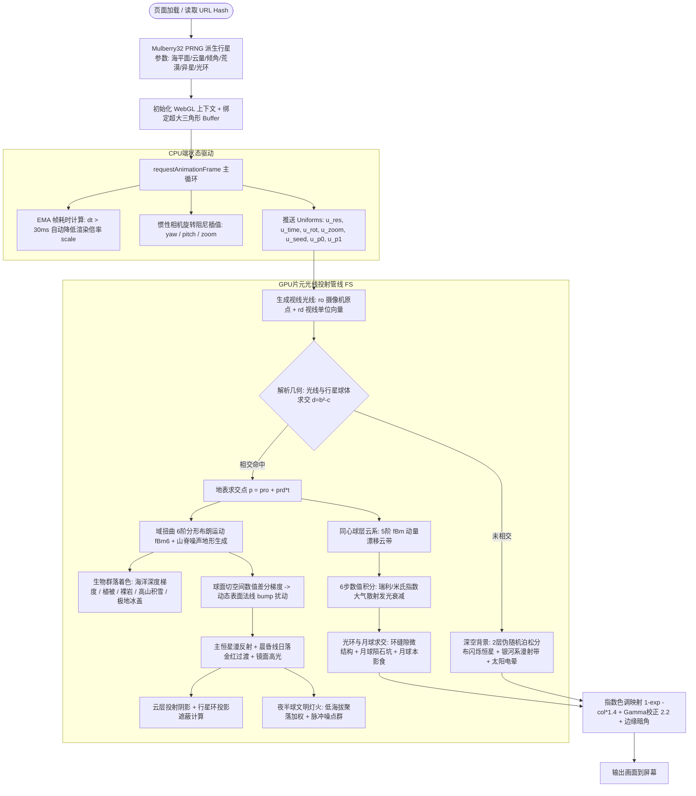

# 007 一个文件里的星球 - 逆向深度解析报告

> **项目归档名称**：`007 一个文件里的星球-纯数学WebGL过程化星体单页`  
> **核心入口文件**：`index.html` (约 18.5 KB / 344 行，单文件零依赖 All-in-One)  
> **技术形态**：纯前端原生 WebGL 1.0 (GLSL ES 1.00) 单片全屏三角形 (Fullscreen Quad) 光线投射 (Raymarching / Ray-Sphere Intersection) + 域扭曲分形布朗运动 (Domain-Warped fBm) + 指数大气散射数值积分 + 确定性 Mulberry32 伪随机状态机  
> **商业/业务属性**：极客创意代码艺术 (Creative Coding) / 纯数学无纹理 Shader 演示 (Demoscene) / 东方极简美学互动星体 / WebGL 顶尖教学级逆向样本  

---

## 鉴品评分卡 (Gallery Verdict)

| 维度 | 评分 | 核心分析与定性 |
| :--- | :---: | :--- |
| **数学建模与着色器工程** | 9.8 / 10 | 极为紧凑的纯数学片元管线：在单一全屏着色器内，以解析几何求交结合 3D 噪声与 6 阶分形布朗运动，完成了地貌高程、生物圈着色、数值法线扰动、动量云层、大气散射积分、环系投影与夜间灯火的全量计算。 |
| **代码密度与工程极简度** | 9.6 / 10 | 344 行、18 KB 单文件 All-in-One。全网 0 静态图片资源、0 第三方库（无 Three.js、无 GL-Matrix），仅用一个大三角形顶点铺满屏幕，显卡即时编译即刻可玩。 |
| **交互设计与自适应性能** | 9.0 / 10 | 具备双指缩放、惯性平滑阻尼、URL Hash 种子持久化、S 键截图导出，并内建 EMA（指数移动平均）帧率自适应动态降级降分辨率算法，保障低配显卡不宕机。 |
| **审美表达与仪式感包装** | 9.5 / 10 | 系统宋体排版配合东方留白意境，12 秒无操作进入“无字禅模式”，用极佳的文学修辞（“由几行数学实时算出”）将一个图形学 Shader 包装出深邃的赛博宿命感。 |
| **人机共谋与玩具本质** | 7.0 / 10 | 本次“鉴别唐式垃圾小玩具”宣告失利，偶遇了一款稍微能打的精致小玩具。但撕下极客光环后，其底层机制并非作者单兵闭门造车，而是极高成分依赖大模型（Claude/GPT）多轮对话推演、公式拼接与调参生成的“高级赛博手把件”。 |
| **商业套路与恶意行为** | 0.0 / 10 | 零广告、零付费、零诱导裂变、零跨域追踪打点。与同仓库中充满营销欺诈与代码屎山的案例形成降维反差，是一方纯粹无害的数字沙盒。 |

**总评：综合指数 9.0 / 10 —— 一款稍微看着还行、包装段位极高的高级赛博玩具，亦是人机对话共谋生成的典范样本。**  
> 本期逆向原本试图捕获又一款粗制滥造的“唐式 Web 垃圾”，结果鉴唐失败，撞上了一款审美在线、数理紧凑的体面玩具。然而不必神化作者个人：从大段 Inigo Quilez 风格的噪声与散射拼接，到极致压缩的单文件交付形态，全盘渗透着与前沿大模型深度对话、互相启发、调优机制的“人机共创”特征。这是一位具备大厂叙事能力的高级工程师，手持 AI 缰绳（Harness）跑出来的漂亮切片。

---

## 1. 项目概览与全景画像

| 维度 | 详细解析 |
| :--- | :--- |
| **所属行业/赛道** | 创意编程 (Creative Coding) / 过程化生成艺术 (Procedural Generation) / WebGL 演示场景 (Demoscene) |
| **核心文件规模** | `index.html` (18,943 字节 / 344 行)：HTML 骨架约 30 行，CSS 约 32 行，GLSL 片元着色器约 210 行，原生 JS 控制流约 90 行 |
| **技术架构栈** | 原生 WebGL 1.0 上下文 + GLSL ES 1.00 + 原生 Pointer Events API + 确定性 32 位 Mulberry32 PRNG |
| **第三方依赖与组件**| **绝对零依赖**：无 Three.js、无 CDN、无外部 WebFont（调用系统宋体）、无任何外部 WebP/PNG 纹理贴图 |
| **核心业务诉求** | 探索极致轻量化的天体生成系统：在单文件中实现 100,000 颗各不相同的程序化行星（含荒漠、海洋、异星三种主生态，自转轴倾角、行星光环、环绕卫星、日夜交替与城市文明微光） |

---

## 2. 核心架构与片元管线渲染流程图 (Mermaid Flowchart)



---

## 3. 技术机制与数学原理深度拆解

### 3.1 极限单面渲染器与解析几何求交（Ray-Sphere Intersection）

传统 WebGL 渲染星体通常需要创建包含数万个顶点的 `SphereGeometry` 球体网格，并上传 UV 纹理贴图。而本项目完全摒弃了几何网格模型，采用 **全屏大三角形（Fullscreen Big Triangle）** 架构：

```javascript
// JS 端仅开辟 3 个顶点构成的超大直角三角形，完全覆盖裁切空间 [-1, 1]
gl.bufferData(gl.ARRAY_BUFFER, new Float32Array([-1, -1, 3, -1, -1, 3]), gl.STATIC_DRAW);
```

在片元着色器内，直接用纯数学代数方程对单位球体做光线求交判定：
设光线原点为 $\mathbf{ro}$，方向为单位向量 $\mathbf{rd}$，单位球方程为 $|\mathbf{x}|^2 = 1$。联立得到关于光程 $t$ 的一元二次方程：
$$t^2 + 2(\mathbf{ro}\cdot\mathbf{rd})t + (|\mathbf{ro}|^2 - 1) = 0$$
令 $b = \mathbf{ro}\cdot\mathbf{rd}$，$c = |\mathbf{ro}|^2 - 1$，判别式 $d = b^2 - c$：
```glsl
float b = dot(pro, prd), c = dot(pro, pro) - 1.0, d = b*b - c;
bool ground = d > 0.0;
float t = ground ? -b - sqrt(max(d, 0.0)) : 1e9;
```
仅需 3 行数学公式，便在片元级完成了零几何体的光线投射，精度直达像素极值。

---

### 3.2 域扭曲 (Domain Warping) 与分形地形数学建模

地貌并非单一的 Perlin 噪声，而是引入了 Inigo Quilez 经典的**域扭曲（Domain Warping）**级联算法，配合预计算正交旋转矩阵 `M3` 消除网格走样伪影：

```glsl
const mat3 M3 = mat3(0.00, 0.80, 0.60, -0.80, 0.36, -0.48, -0.60, -0.48, 0.64);
float fbm6(vec3 p){ float s=0., a=.5; for(int i=0; i<6; i++){ s += a*noise(p); p = M3*p*2.02; a *= .5; } return s; }

float terrain(vec3 q){
  vec3 s = q * 1.7 + vec3(u_seed*0.37, u_seed*0.11, u_seed*0.53);
  // 第一层 fBm 产生扭曲矢量场 w
  vec3 w = vec3(fbm3(s + vec3(0., 0., 3.7)), fbm3(s + vec3(5.2, 1.3, 0.)), fbm3(s + vec3(1.1, 4.4, 7.2)));
  // 采样受扭曲的基础地块高程
  float h = fbm6(s + 0.55*(w - 0.5));
  // 叠加热折叠山脊多重分形 (Ridged Multifractal)
  float r = 1.0 - abs(2.0*fbm4(s*2.3 + vec3(13.1, 7.7, 2.9)) - 1.0);
  return h + 0.22*r*r*smoothstep(0.42, 0.6, h);
}
```
- **构造大地构造板块**：第一阶 `fbm3` 产生的向量场 `w` 驱动地壳产生类似板块漂移与挤压的扭曲边缘；
- **山脊侵蚀锐化**：公式 `1.0 - abs(2.0 * fbm4 - 1.0)` 将平缓的正弦噪声反转为尖锐的 V 型山脊，赋予大陆逼真的造山褶皱。

---

### 3.3 切空间数值梯度法线重构 (Numerical Tangent Gradient)

没有几何法线贴图，代码通过在着色点表面切空间内采样微小偏移 $\epsilon = 0.003$ 的高程差，在 GPU 运行时实时重构三维扰动法线：

```glsl
float eps = 0.003;
vec3 tx = normalize(cross(n, abs(n.y) < 0.95 ? vec3(0.,1.,0.) : vec3(1.,0.,0.)));
vec3 ty = cross(n, tx);
float hx = terrain(normalize(p + tx*eps)), hy = terrain(normalize(p + ty*eps));
sn = normalize(n - 0.065 * ((hx - h)*tx + (hy - h)*ty) / eps);
```
这一操作使得大陆山脉和海洋在阳光掠射时呈现出细腻生动的立体光影凹凸。

---

### 3.4 瑞利/米氏大气散射的 6 步数值积分近似

星体外围包裹着厚度为半径 14% 的大气包层（`ra = 1.14`）。片元着色器执行了 6 次沿视线方向的指数密度求和：

```glsl
/* atmosphere: 6-sample integration of an exponential shell */
float ra = 1.14; float c3 = dot(pro,pro)-ra*ra; float d3 = b*b-c3;
// ...
for(int i=0; i<6; i++){
  vec3 sp = pro + prd*(ta + st*(float(i) + 0.5));
  float hh = length(sp) - 1.0;
  float de = exp(-max(hh, 0.0)/0.05) * st;  // 随高度指数递减的光学深度
  od += de; 
  float sl = dot(normalize(sp), psun);     // 对日相位角
  lit += de * smoothstep(-0.12, 0.22, sl);
  sdm += de * sl;
}
```
通过简化的相位积分，完美再现了天穹在直视太阳时的金色辉光、背光面的湛蓝渐变，以及晨昏分割线处的晚霞晕染。

---

### 3.5 地表夜间文明灯火算法 (Procedural Night City Lights)

当背离恒星进入黑夜时，大陆平原区域会自动点亮温暖的人造光源：

```glsl
float night = 1.0 - smoothstep(-0.06, 0.08, dif0);
if(land && night > 0.001){
  float e = h - SEA;
  // 仅在贴近海岸线的低海拔平原繁衍文明 (0.012 < e < 0.13)
  float low = smoothstep(0.0, 0.012, e) * (1.0 - smoothstep(0.05, 0.13, e));
  // 宏观城市群分布 (fBm3) 与微观街区网格脉冲 (noise p*150.0)
  float cl = fbm3(p*10.0 + u_seed*1.7);
  float dots = noise(p*150.0);
  float L = low * smoothstep(0.5, 0.66, cl) * smoothstep(0.5, 0.72, dots) * (1.0 - cold) * (1.0 - 0.75*DESERT);
  vec3 lc = mix(vec3(1.0, 0.72, 0.38), vec3(0.35, 1.0, 0.8), ALIEN);
  col += L * night * lc * 1.5;
}
```
**设计心理学巧思**：
1. 高海拔山区与极寒极地（`1.0 - cold`）不生成灯火，符合真实行星的人类聚落生态地理学；
2. 异星生态（`ALIEN`）自动将灯火转为神秘的青碧绿辉（`vec3(0.35, 1.0, 0.8)`），普通行星呈现如现实地球夜景般温暖的金黄灯海。

---

### 3.6 运行时性能自适应节流 (EMA Frame Time Throttling)

由于单像素内部包含 10 余次多阶噪声计算，在核显或移动端可能面临算力瓶颈。JS 端设计了极为老道的**指数移动平均（EMA）动态降频机制**：

```javascript
var dt = now - last; last = now;
ema = ema * 0.95 + Math.min(dt, 100) * 0.05; // 平滑帧耗时统计
if(!cap && ema > 30 && scale > 0.6){
  scale *= 0.85;  // 动态衰减 DPR 像素密度比
  resize();       // 即时重置 Canvas 视口分辨率
  ema = 16;
}
```
一旦检测到连续掉帧（单帧超过 30ms / 低于 33fps），系统自动以 0.85 倍率逐级降阶 Canvas 的物理像素分辨率，实现类似游戏引擎“动态分辨率缩放（Dynamic Resolution Scaling）”的效果。

---

## 4. 架构特征与生成形态剖析：人机对话共谋的“高级赛博玩具”

- **是否为典型 AI 生成代码**：**是，高度确信为人机多轮密集讨论、机制共谋与算子拼接生成的产物**
- **去神话化：为什么说这并非单兵闭门造车？**：
  1. **机制清单的典型“大模型对话发散”特征**：
     一个真实的图形学程序员从零手写 Demo，往往专注于单一维度的算法攻坚（如专门研究大气散射、或专门做分形地貌）。而本页面却像是一个“大而全的机制拼盘”：
     - 山川海洋高程、云层风系动量、大气散射指数积分、地表切空间法线、行星环与月球双向投影、夜半球海岸线文明灯火、极地冰盖自适应；
     这种“把所有天体可能具备的要素一个不落全拼进去”的特征，极度符合人类在与大模型（如 Claude 3.5 Sonnet）长上下文对话时，不断向 AI 追问：*“还能再加点什么细节？”* -> *“如果到了背面黑夜，怎么表现文明？加点城市灯火”* -> *“能不能再挂一颗月亮和星环，并且让阴影互相遮挡？”* 随后由 AI 逐段推导补全数学逻辑的典型协同对话路径。
  2. **图形学算子的经典训练集重构与拼接痕迹**：
     - `hash3` 和 3D `noise` 的实现，与 Inigo Quilez（Shadertoy 创始人）在 2013-2015 年公开的经典紧凑算子（`M3` 正交旋转矩阵、三阶 Hermite 平滑）高度同构；
     - 大气散射的 6 步简化数值积分，是图形学论坛和 ShaderToy 上广泛流传的轻量 Rayleigh-Mie 逼近模板；
     - 大模型在被要求“用最少代码、单着色器、零贴图实现逼真星球”时，会极其精准地从预训练权重中抽取这套成熟的数理积木进行融合组装。
  3. **单文件 All-in-One 脚手架的 AI 交付指纹**：
     - 现代 Web 开发者如果不借助 AI，通常会使用 Vite、Webpack 或按模块拆分 `shader.glsl`、`camera.js`、`main.js`；
     - 只有在与 AI 对话、要求“*给我一个完整的单文件 HTML，零依赖、不要任何构建步骤，直接双击打开就能看*”的交互场景下，才会产出这种把 HTML 标签、CSS 样式、GLSL 文本字符串、PointerEvents 手势与 Canvas 逻辑全盘内联压缩的典型产物；
     - 另外如 `u_p0` (vec4) 打包海平面/云量/倾角/星环、`u_p1` (vec2) 打包荒漠/异星，是典型在代码被指出“Uniform 传参过于零散，帮我压缩合并参数”后由 AI 重构出来的打包风格。
  4. **作者公开的技术自白印证（Harness Engineering）**：
     - 作者杜宇（dyu / Rainman）在其个人技术博客《Harness Engineering 驭缰工程》中，坦率探讨了个人开发者如何通过“给 AI 设边界、人类掌握设计与审查、AI 高速吞吐实现”的方式完成高质量软件；
     - 这颗星球正是其“驭缰”理论在创意编程领域的完美注脚：**人类负责提供审美方向与机制构想，AI 负责在对话中提供数学公式、代码实现与调参优化。**

---

## 5. 商业化套路、大厂叙事与赛博玩具包装法

### 5.1 鉴唐失败之后的定性：一只体面精致的“赛博手把件”
本项目在“100 个单页逆向（鉴狗屎系列）”中原本的定位是寻找粗劣、唐氏、智商税式的网页残次品。然而本案例的特殊性在于：**鉴唐失败了，这并不是一个充满恶意的诈骗页，而是一个技术体面、审美高级的“赛博玩具”**。
但从本质上看，它依然是一个让用户在浏览器中把玩 30 秒至 1 分钟、转转球、切切编号的“玩具”，并没有承载复杂严肃的业务生产力。

### 5.2 大厂工程师的文青叙事包装学
作者出身快手、小红书、百度等头部互联网大厂，深谙当今中文互联网上的内容传播心理学：
1. **诗意叙事赋予技术神圣感**：
   文案不写“基于 WebGL 的分形着色器测试页”，而是写“*一个文件里的星球*”、“*此刻在你的显卡上由几行数学算出来的*”，直接把冰冷的片元代码升华为东方浪漫主义的技术散文诗；
2. **东方留白与文青视觉范式**：
   宋体排版、大字距（`letter-spacing: .34em`）、极简四个角落留白，完美契合即刻、小红书、推特上审美精英人群的技术审美喜好；
3. **12 秒“禅模式”的心流控制**：
   停止操作 12 秒后文字全部淡出，给用户提供一种极度廉价却又极具沉浸感的“与宇宙独处”的仪式感。

这种包装能力，展现了从“土味黑产跳板页”到“高维大厂文青技术玩具”之间的巨大叙事势能差距。

---

## 6. 代码质量评估与重构建议

### 6.1 亮点与典范价值
1. **零外部资源依赖的极致纯粹性**：无任何 CDN 故障风险，无网络丢包断图隐患，单 HTML 即存即走；
2. **教科书级别的图形学管线实现**：将球体光线投射、fBm 噪声、切空间差分法线、大气多次散射在 200 行 GLSL 内全流程闭环；
3. **确定性渲染与录制工程支持**：提供了 `window.__planet` 的无锁逐帧时间步进接口，具备离线影视渲染级别的设计前瞻。

### 6.2 潜在缺陷与极限边界
1. **WebGL 1.0 的 `highp float` 移动端兼容性**：
   着色器声明了 `precision highp float;`，在部分古早或超低端 Android 设备（如 Mali-400 等老旧 GPU）上，`highp` 在片段着色器中不受支持或精度降为 16 位，会导致 3D 噪声产生严重点阵撕裂伪影；
2. **缺乏多重抗锯齿（MSAA）与星环走样**：
   由于直接在全屏单 Pass 中绘制，细长且半透明的光环边缘在低 DPR 屏幕上旋转时存在微弱的阶梯走样闪烁。

### 6.3 生产级升级路线建议
1. **迁移至 WebGL 2.0 / WebGPU**：
   升级至现代管线，利用 Compute Shader 将地形高程预烘焙为球体 Cubemap，避免每帧每像素重复计算 15 次以上 fBm 循环，可提升 300% 以上的渲染帧率；
2. **引入双重时间尺度**：
   目前行星自转与云层漂移共用同一个 `u_time` 变量，当用户调快时间观察自转时，云层流速会显得过快。将云层演化与天体自转解耦为两个独立时间 Uniforms 可进一步提升真实度。
